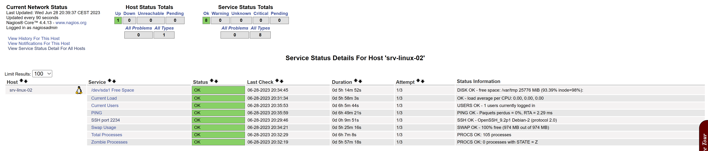
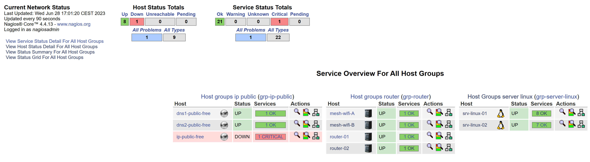

<a name="Installation_NRPE_4.1.0-client.md"></a>


## Installation du plugin NRPE 4.1.0 + Nagios-plugins depuis la machine distante (srv-linux-02).
Celle-ci est effectuée depuis les sources.

Toutes les commandes à partir de ce point seront en tant que root.

- Conditions préalables, assurez-vous que les packages suivants sont installés.
```
apt-get update && apt upgrade -y
apt-get install -y autoconf automake gcc libc6 libmcrypt-dev make libssl-dev wget
```
- Téléchargement de l'archive nrpe-4.1.0.tar.gz (source).
```
mkdir -p /opt/nrpe/
cd /opt/nrpe/

wget --no-check-certificate -O nrpe.tar.gz https://github.com/NagiosEnterprises/nrpe/archive/nrpe-4.1.0.tar.gz
```
- Extraction de l'archive nrpe.tar.gz.
```
tar -xvzf nrpe.tar.gz
```
- Compilation depuis les sources du plugin NRPE.

Notez que si vous souhaitez transmettre des arguments via NRPE, vous devez le spécifier dans l'option de configuration, comme indiqué ci-dessous. Si vous préférez, vous pouvez omettre le drapeau --enable-command-args. La suppression de cet indicateur nécessitera que tous les arguments soient explicitement définis dans le fichier nrpe.cfg sur chaque serveur surveillé.
```
cd nrpe-nrpe-4.1.0/
./configure --enable-command-args

make all
```
- Créer un utilisateur et un groupe.

Cela crée l'utilisateur et le groupe nagios.
```
make install-groups-users
```
- Installer les binaires.

Cette étape installe les fichiers binaires, le démon NRPE et le plugin check_nrpe.

Si vous souhaitez uniquement installer le démon, exécutez la commande make install-daemon au lieu de la commande ci-dessous. Cependant, il est utile d'avoir installé le plugin check_nrpe à des fins de test.

Si vous souhaitez uniquement installer le plug-in check_nrpe, reportez-vous à la section au bas de cet article de la base de connaissances, car de nombreuses étapes peuvent être ignorées. L'installation du plugin uniquement se fait généralement sur votre serveur et vos workers Nagios.
```
make install
```
- Installer les fichiers de configuration.
Cela installe les fichiers de configuration.
```
make install-config
```
- Mettre à jour le fichier des services.

Le fichier /etc/services est utilisé par les applications pour traduire les noms de service lisibles par l'homme en numéros de port lors de la connexion à une machine sur un réseau.
```
echo >> /etc/services
echo '# Nagios services' >> /etc/services
echo 'nrpe    5666/tcp' >> /etc/services

nano /etc/services

# Local services

# Nagios services
nrpe    5666/tcp

```
- Installer le service/le démon.
Cela installe les fichiers de service ou de démon.
```
make install-init
systemctl enable nrpe.service
```
Les informations sur le démarrage et l'arrêt des services seront expliquées plus loin.

- Configurer le pare-feu.
Le port 5666 est utilisé par NRPE et doit être ouvert sur le pare-feu local.
```
iptables -I INPUT -p tcp --destination-port 5666 -j ACCEPT
apt-get install -y iptables-persistent

Answer yes to saving existing rules

iptables-save > /etc/iptables/rule
```
- Mettre à jour le fichier de configuration.
Le fichier nrpe.cfg est l'endroit où les paramètres suivants seront définis. Il est situé :
```
nano /usr/local/nagios/etc/nrpe.cfg

allowed_hosts=
```
À ce stade, NRPE n'écoutera que les demandes provenant de lui-même (127.0.0.1). Si vous vouliez que votre serveur nagios puisse se connecter, ajoutez son adresse IP après une virgule (dans cet exemple c'est 10.25.5.2) :
```
allowed_hosts=127.0.0.1,192.168.50.200

dont_blame_nrpe=
```
Cette option détermine si le démon NRPE autorise ou non les clients à spécifier des arguments pour les commandes qui sont exécutées. Nous allons autoriser cela, car cela permet des configurations NPRE plus avancées.
```
dont_blame_nrpe=1
```
Les commandes suivantes effectuent les modifications de configuration décrites ci-dessus.
```
sed -i '/^allowed_hosts=/s/$/,192.168.50.200/' /usr/local/nagios/etc/nrpe.cfg
sed -i 's/^dont_blame_nrpe=.*/dont_blame_nrpe=1/g' /usr/local/nagios/etc/nrpe.cfg
```
- Démarrer le service/démon.
Différentes distributions Linux ont différentes méthodes de démarrage de NRPE.
```
systemctl start nrpe.service
```
```
systemctl status nrpe.service

● nrpe.service - Nagios Remote Plugin Executor
     Loaded: loaded (/lib/systemd/system/nrpe.service; enabled; preset: enabled)
     Active: active (running) since Wed 2023-06-28 14:07:37 CEST; 1min 8s ago
       Docs: http://www.nagios.org/documentation
   Main PID: 4047 (nrpe)
      Tasks: 1 (limit: 4644)
     Memory: 1.0M
        CPU: 10ms
     CGroup: /system.slice/nrpe.service
             └─4047 /usr/local/nagios/bin/nrpe -c /usr/local/nagios/etc/nrpe.cfg -f

juin 28 14:07:37 srv-linux-02 systemd[1]: Started nrpe.service - Nagios Remote Plugin Executor.
juin 28 14:07:37 srv-linux-02 nrpe[4047]: Starting up daemon
juin 28 14:07:37 srv-linux-02 nrpe[4047]: Server listening on 0.0.0.0 port 5666.
juin 28 14:07:37 srv-linux-02 nrpe[4047]: Server listening on :: port 5666.
juin 28 14:07:37 srv-linux-02 nrpe[4047]: Warning: Daemon is configured to accept command arguments from clients!
juin 28 14:07:37 srv-linux-02 nrpe[4047]: Listening for connections on port 5666
juin 28 14:07:37 srv-linux-02 nrpe[4047]: Allowing connections from: 127.0.0.1,192.168.50.201
```
Test NRPE.
Vérifiez maintenant que NRPE écoute et répond aux demandes.
```
/usr/local/nagios/libexec/check_nrpe -H 127.0.0.1
```
Vous devriez voir une sortie semblable à celle-ci :
```
NRPE v4.1.0
```
Si vous obtenez le numéro de version NRPE (comme indiqué ci-dessus), NRPE est installé et configuré correctement.

Vous pouvez également tester à partir de votre hôte Nagios en exécutant la même commande ci-dessus, mais au lieu de 127.0.0.1, vous devrez le remplacer par l'adresse IP / le nom DNS de la machine avec NRPE en cours d'exécution.

- Commandes service/démon.
Différentes distributions Linux ont différentes méthodes de démarrage / arrêt / redémarrage / statut NRPE.
```
systemctl start nrpe.service
systemctl stop nrpe.service
systemctl restart nrpe.service
systemctl status nrpe.service
```
## Installation des plugins Nagios, normalement ceux-ci ont été installés auparavant lors de l'installation de Nagios Core.
En revanche il sera nécessaire d'installer ceux-ci sur la machine Linux distante à superviser. NRPE a besoin de Nagios-plugins pour fonctionner correctement.

- Installation de Nagios-plugins dans sa dernière version stable.
- Conditions préalables.
- Installer les packages prérequis.
```
mkdir -p /opt/nagios/
cd /opt/nagios/
```
```
apt install -y \
       autoconf \
       gcc \
       libc6 \
       libmcrypt-dev \
       make \
       libssl-dev \
       wget \
       bc \
       gawk \
       dc \
       build-essential \
       snmp \
       libnet-snmp-perl \
       gettext
```

- Téléchargement des sources de Nagios-plugins dans sa dernère version stable.

```
VER=$(curl -s https://api.github.com/repos/nagios-plugins/nagios-plugins/releases/latest|grep tag_name | cut -d '"' -f 4|sed 's/release-//')
wget https://github.com/nagios-plugins/nagios-plugins/releases/download/release-$VER/nagios-plugins-$VER.tar.gz
```

- Extraire l'archive nagios-plugins-$VER.tar.gz.

```
tar xvf nagios-plugins-$VER.tar.gz
```
- E. Compilation depuis les sources de Nagios-plugins.
```
cd nagios-plugins-$VER
./tools/setup
./configure
make
make install
```
- Test NRPE + Plugins.

Vous pouvez maintenant vérifier que NRPE exécute correctement les plugins. 
Le fichier de configuration par défaut /usr/local/nagios/etc/nrpe.cfg contient la commande suivante :
```
command[check_load]=/usr/local/nagios/libexec/check_load -w 15,10,5 -c 30,25,20
```
Utilisation de la commande check_load pour tester NRPE :
```
/usr/local/nagios/libexec/check_nrpe -H 127.0.0.1 -c check_load
```
Vous devriez voir une sortie semblable à celle-ci :
```
OK - load average per CPU: 0.04, 0.04, 0.04|load1=0.043;0.150;0.300;0; load5=0.043;0.100;0.250;0; load15=0.037;0.050;0.200;0;
```
Vous pouvez également tester à partir de votre hôte Nagios en exécutant la même commande ci-dessus, mais au lieu de 127.0.0.1, vous devrez le remplacer par l'adresse IP / le nom DNS de la machine avec NRPE en cours d'exécution.

Depuis mon serveur Nagios core (srv-linux-01) en 192.168.50.201 vers ma machine Linux (srv-linu-02) hôte distante 192.168.50.201
```
/usr/local/nagios/etc/objects# /usr/local/nagios/libexec/check_nrpe -H 192.168.50.201
NRPE v4.1.0
```

Configuration des vérifications à distance à l'aide de nrpe dans le fichier de configuration des hôtes nagios

Si le serveur nagios peut se connecter au client à l'aide de 'check_nrpe', nous pouvons configurer le fichier de définition d'hôte sur le serveur pour surveiller des paramètres tels que l'espace disque et les processus, etc. Exemple de définition qui utilise nrpe pour vérifier la charge sur la machine de destination est :

Exemple : Extrait en provenance du serveur (srv-linux-01) Nagios Core --> /usr/local/nagios/etc/objects/server-linux.cfg

```
# --------------------------------------------------------------------------
# DEFINITION SERVICE - srv-linux-02 - Current Load
# --------------------------------------------------------------------------
define service {

     use                     generic-service
     host_name               srv-linux-02
     service_description     Current Load
     check_command           check_nrpe!check_load
}
```
```
# --------------------------------------------------------------------------
# DEFINITION SERVICE - srv-linux-02 - Current Users
# --------------------------------------------------------------------------
define service {

     use                     generic-service
     host_name               srv-linux-02
     service_description     Current Users
     check_command           check_nrpe!check_users
}
```
```
# --------------------------------------------------------------------------
# DEFINITION SERVICE - srv-linux-02 - Root Partition
# --------------------------------------------------------------------------
define service {

     use                     generic-service
     host_name               srv-linux-02
     service_description     /dev/sda1 Free Space
     check_command           check_nrpe!check_sda1
}
```
```
# --------------------------------------------------------------------------
# DEFINITION SERVICE - srv-linux-02 - Zombie Processes
# --------------------------------------------------------------------------
define service {

     use                     generic-service
     host_name               srv-linux-02
     service_description     Zombie Processes
     check_command           check_nrpe!check_zombie_procs
}
```
```
# --------------------------------------------------------------------------
# DEFINITION SERVICE - srv-linux-02 - Total Processes
# --------------------------------------------------------------------------
define service {

     use                     generic-service
     host_name               srv-linux-02
     service_description     Total Processes
     check_command           check_nrpe!check_total_procs
}
```
```
# --------------------------------------------------------------------------
# DEFINITION SERVICE - srv-linux-02 - Swap Usage
# --------------------------------------------------------------------------
define service {

     use                     generic-service
     host_name               srv-linux-02
     service_description     Swap Usage
     check_command           check_nrpe!check_swap
}
```
```
# --------------------------------------------------------------------------
# DEFINITION SERVICE - srv-linux-02 - SSH port 2234
# --------------------------------------------------------------------------
define service {

     use                     generic-service
     host_name               srv-linux-02
     service_description     SSH port 2234
     check_command           check_ssh!--port=2234
}
```
Modification des paramètres d'avertissement.

Notez que vous pouvez vérifier les valeurs de seuil pour l'avertissement et la critique dans le fichier de configuration /etc/nagios/nrpe.conf sur l'hôte de destination où les commandes sont définies. Par exemple, pour avertir si les processus sont supérieurs à 200 (par défaut) 150, nous pouvons modifier les valeurs 150, 200 à 200, 250 avec la ligne de configuration résultante comme :
```
command[check_total_procs]=/usr/lib64/nagios/plugins/check_procs -w 200 -c 250
```
Concernant command[check_*] :
```
/usr/local/nagios/etc/nrpe.cfg
```
Les exemples suivants utilisent des arguments de commande codés en dur...
C'est de loin la méthode la plus sûre d'utilisation de NRPE.
```
command[check_users]=/usr/local/nagios/libexec/check_users -w 5 -c 10
command[check_load]=/usr/local/nagios/libexec/check_load -r -w .15,.10,.05 -c .30,.25,.20
command[check_sda1]=/usr/local/nagios/libexec/check_disk -w 20% -c 10% -p /dev/sda1
command[check_zombie_procs]=/usr/local/nagios/libexec/check_procs -w 5 -c 10 -s Z
command[check_total_procs]=/usr/local/nagios/libexec/check_procs -w 150 -c 400
command[check_swap]=/usr/local/nagios/libexec/check_swap -w 50% -c 30%
```
Créer un nouveau service : exemple check_mrpe!check_ssh_2234

GENERIC SERVICE
```
command[check_services]=/usr/local/nagios/libexec/check_services -p $ARG1$
```
Ligne à rajouter dans /usr/local/nagios/etc/nrpe.cfg
```
command[check_ssh_2234]=/usr/local/nagios/libexec/check_ssh -p 2234
```
Test depuis le serveur 192.168.50.200 :
/usr/local/nagios/libexec/check_ssh -p2234 192.168.50.201

On obtient le résultat suivant concernant la supervision des services du serveur distant (srv-linux-02).




nagios_service_Host_Groups_1.png
Il faudra également installer NRPE 4.1.0 + Nagios-plugins sur la machine distante (srv-linux-02). Cela prendra tout son sens afin de monitorer celle-ci.
