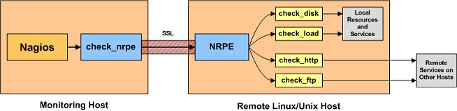
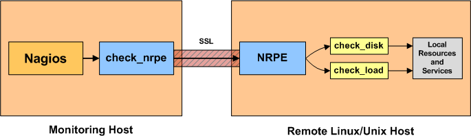
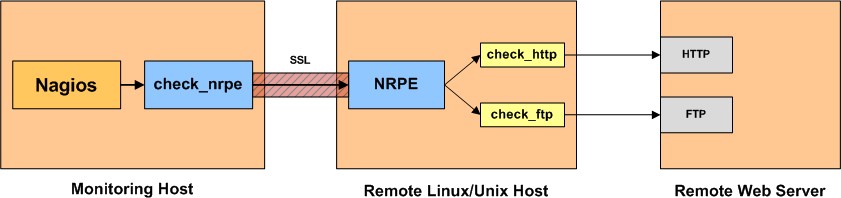

<a name="Installation_NRPE_4.1.0-server.md"></a>


## Installation du plugin NRPE 4.1.0 depuis le serveur qui héberge Nagios Core 4.x.x.
Celle-ci est effectuée depuis les sources.

## Menu :

| Cat | Etapes |
|------|------| 
| - H. | [Installation du plugin NRPE 4.1.0 depuis le serveur qui héberge Nagios Core.](Installation_NRPE_4.1.0-server.md) |
| - I. | [Installation du plugin NRPE 4.1.0 + Nagios-plugins depuis la machine distante Linux à monitorer.](Installation_NRPE_4.1.0-client.md) |

## Aperçu du plugin NRPE :

L'addon NRPE est conçu pour vous permettre d'exécuter des plugins Nagios sur des machines Linux/Unix distantes. La principale raison de faire cela est de permettre à Nagios de surveiller les ressources "locales" (comme la charge CPU, l'utilisation de la mémoire, etc.) sur des machines distantes. Étant donné que ces ressources publiques ne sont généralement pas exposées à des machines externes, un agent comme NRPE doit être installé sur les machines Linux/Unix distantes.

Remarque : Il est possible d'exécuter des plugins Nagios sur des machines Linux/Unix distantes via SSH. Il existe un plugin check_by_ssh qui vous permet de le faire. L'utilisation de SSH est plus sécurisée que l'agent NRPE, mais elle impose également une surcharge (CPU) plus importante sur les machines de surveillance et distantes. Cela peut devenir un problème lorsque vous commencez à surveiller des centaines ou des milliers de machines. De nombreux administrateurs Nagios optent pour l'utilisation de l'addon NRPE en raison de la charge inférieure qu'il impose.

L'addon NRPE se compose de deux éléments :

- Le plug-in check_nrpe, qui réside sur la machine de surveillance locale.
- Le démon NRPE, qui s'exécute sur la machine Linux/Unix distante.
Lorsque Nagios a besoin de surveiller une ressource de service depuis une machine Linux/Unix distante :

Nagios exécutera le plugin check_nrpe et lui indiquera quel service doit être vérifié.
- Le plug-in check_nrpe contacte le démon NRPE sur l'hôte distant via une connexion (éventuellement) protégée par SSL.
- Le démon NRPE exécute le plugin Nagios approprié pour vérifier le service ou la ressource.
- Les résultats de la vérification du service sont transmis du démon NRPE au plug-in check_nrpe, qui renvoie ensuite les résultats de la vérification au processus Nagios.
  
Remarque : Le démon NRPE nécessite que les plugins Nagios soient installés sur l'hôte Linux/Unix distant. Sans cela, le démon ne serait pas en mesure de surveiller quoi que ce soit.

Contrôles directs :

L'utilisation la plus simple de l'addon NRPE est de surveiller les ressources "locales" ou "privées" sur une machine Linux/Unix distante. Cela inclut des éléments tels que la charge du processeur, l'utilisation de la mémoire, l'utilisation de l'échange, les utilisateurs actuels, l'utilisation du disque, les états des processus, etc.



Contrôles indirects :

Vous pouvez également utiliser l'addon NRPE pour vérifier indirectement les services et ressources "publics" des serveurs distants qui pourraient ne pas être accessibles directement depuis l'hôte de surveillance. Par exemple, si l'hôte distant sur lequel le démon NRPE et les plug-ins sont installés peut communiquer avec un serveur Web distant (mais pas l'hôte de surveillance), vous pouvez configurer le démon NRPE pour vous permettre de surveiller indirectement le serveur Web distant. Le démon NRPE agit essentiellement comme proxy dans ce cas.



Contrôles indirects :

Vous pouvez également utiliser l'addon NRPE pour vérifier indirectement les services et ressources "publics" des serveurs distants qui pourraient ne pas être accessibles directement depuis l'hôte de surveillance. Par exemple, si l'hôte distant sur lequel le démon NRPE et les plug-ins sont installés peut communiquer avec un serveur Web distant (mais pas l'hôte de surveillance), vous pouvez configurer le démon NRPE pour vous permettre de surveiller indirectement le serveur Web distant. Le démon NRPE agit essentiellement comme proxy dans ce cas.



## C'est parti.

Ce document décrit comment installer et configurer NRPE à partir de la source pour une utilisation avec Nagios Coreou ou Nagios XI. L'agent linux-nrpe fourni avec Nagios XI n'est pris en charge que sur CentOS, RHEL, OpenSUSE, SLES, Ubuntu et Debian. La plupart des environnements surveillés consistent en de nombreuses distributions différentes, il peut donc être nécessaire de compiler NRPE et ses plugins associés.

Cette procédure est destinée aux administrateurs de Nagios Core ou Nagios XI qui découvrent NRPE et doivent utiliser une méthode d'installation basée sur la source pour NRPE, généralement en raison de distributions Linux non prises en charge ou de restrictions de sécurité dans les environnements d'entreprise.

Ce guide vous demande d'installer NRPE 4.1.0 et Nagios-Plugins, mais les futures versions devraient également fonctionner correctement avec ces étapes.

Il est supposé que vous êtes connecté à la machine sur laquelle vous installez NRPE en tant qu'utilisateur racine ou en tant qu'utilisateur disposant de privilèges suffisants. Toutes les étapes ci-dessous ont été testées sur Debian 11 & DBIAN 12. Certains systèmes d'exploitation comme Ubuntu et SUSE ont des autorisations utilisateur plus strictes, dans ces cas, les commandes répertoriées ont sudo devant elles pour vous assurer que vous êtes en mesure de suivre les étapes. Tous les efforts ont été faits pour s'assurer que si vous suivez toutes les étapes pertinentes, vous obtiendrez une installation fonctionnelle de NRPE.

Toutes les commandes à partir de ce point seront en tant que root.

- Conditions préalables, assurez-vous que les packages suivants sont installés.
```
apt-get update
apt-get install -y autoconf automake gcc libc6 libmcrypt-dev make libssl-dev wget
```
- Téléchargement de l'archive nrpe-4.1.0.tar.gz (source).
```
mkdir -p /opt/nrpe/
cd /opt/nrpe/

wget --no-check-certificate -O nrpe.tar.gz https://github.com/NagiosEnterprises/nrpe/archive/nrpe-4.1.0.tar.gz
```
- Extraction de l'archive nrpe.tar.gz.
```
tar -xvzf nrpe.tar.gz
```
- Compilation depuis les sources du plugin NRPE.

Notez que si vous souhaitez transmettre des arguments via NRPE, vous devez le spécifier dans l'option de configuration, comme indiqué ci-dessous. Si vous préférez, vous pouvez omettre le drapeau --enable-command-args. La suppression de cet indicateur nécessitera que tous les arguments soient explicitement définis dans le fichier nrpe.cfg sur chaque serveur surveillé.
```
cd nrpe-nrpe-4.1.0/
./configure --enable-command-args

make all
```
- Créer un utilisateur et un groupe.

Cela crée l'utilisateur et le groupe nagios.
```
make install-groups-users
```
- Installer les binaires.

Cette étape installe les fichiers binaires, le démon NRPE et le plugin check_nrpe.

Si vous souhaitez uniquement installer le démon, exécutez la commande make install-daemon au lieu de la commande ci-dessous. Cependant, il est utile d'avoir installé le plugin check_nrpe à des fins de test.

Si vous souhaitez uniquement installer le plug-in check_nrpe, reportez-vous à la section au bas de cet article de la base de connaissances, car de nombreuses étapes peuvent être ignorées. L'installation du plugin uniquement se fait généralement sur votre serveur et vos workers Nagios.
```
make install
```
- Installer les fichiers de configuration.
Cela installe les fichiers de configuration.
```
make install-config
```
- Mettre à jour le fichier des services.

Le fichier /etc/services est utilisé par les applications pour traduire les noms de service lisibles par l'homme en numéros de port lors de la connexion à une machine sur un réseau.
```
echo >> /etc/services
echo '# Nagios services' >> /etc/services
echo 'nrpe    5666/tcp' >> /etc/services
```
- Installer le service/le démon.
Cela installe les fichiers de service ou de démon.
```
make install-init
systemctl enable nrpe.service
```
Les informations sur le démarrage et l'arrêt des services seront expliquées plus loin.

- Configurer le pare-feu.
Le port 5666 est utilisé par NRPE et doit être ouvert sur le pare-feu local.
```
iptables -I INPUT -p tcp --destination-port 5666 -j ACCEPT
apt-get install -y iptables-persistent

Answer yes to saving existing rules

iptables-save > /etc/iptables/rule
```
- Mettre à jour le fichier de configuration.
Le fichier nrpe.cfg est l'endroit où les paramètres suivants seront définis. Il est situé :
```
/usr/local/nagios/etc/nrpe.cfg

allowed_hosts=
```
À ce stade, NRPE n'écoutera que les demandes provenant de lui-même (127.0.0.1). Si vous vouliez que votre serveur nagios puisse se connecter, ajoutez son adresse IP après une virgule (dans cet exemple c'est 10.25.5.2) :
```
allowed_hosts=127.0.0.1,192.168.50.200

dont_blame_nrpe=
```
Cette option détermine si le démon NRPE autorise ou non les clients à spécifier des arguments pour les commandes qui sont exécutées. Nous allons autoriser cela, car cela permet des configurations NPRE plus avancées.
```
dont_blame_nrpe=1
```
Les commandes suivantes effectuent les modifications de configuration décrites ci-dessus.
```
sed -i '/^allowed_hosts=/s/$/,192.168.50.200/' /usr/local/nagios/etc/nrpe.cfg
sed -i 's/^dont_blame_nrpe=.*/dont_blame_nrpe=1/g' /usr/local/nagios/etc/nrpe.cfg
```
- Démarrer le service/démon.
Différentes distributions Linux ont différentes méthodes de démarrage de NRPE.
```
systemctl start nrpe.service
```
Test NRPE.
Vérifiez maintenant que NRPE écoute et répond aux demandes.
```
/usr/local/nagios/libexec/check_nrpe -H 127.0.0.1
```
Vous devriez voir une sortie semblable à celle-ci :
```
NRPE v4.1.0
```
Si vous obtenez le numéro de version NRPE (comme indiqué ci-dessus), NRPE est installé et configuré correctement.

Vous pouvez également tester à partir de votre hôte Nagios en exécutant la même commande ci-dessus, mais au lieu de 127.0.0.1, vous devrez le remplacer par l'adresse IP / le nom DNS de la machine avec NRPE en cours d'exécution.

- Commandes service/démon.
Différentes distributions Linux ont différentes méthodes de démarrage / arrêt / redémarrage / statut NRPE.
```
systemctl start nrpe.service
systemctl stop nrpe.service
systemctl restart nrpe.service
systemctl status nrpe.service
```
## Installation des plugins Nagios, normalement ceux-ci ont été installés auparavant lors de l'installation de Nagios Core.
En revanche il sera nécessaire d'installer ceux-ci sur la machine Linux distante à superviser. NRPE a besoin de Nagios-plugins pour fonctionner correctement.

- Installation de Nagios-plugins dans sa dernière version stable.
- Conditions préalables.
- Installer les packages prérequis.
```
mkdir -p /opt/nagios/
cd /opt/nagios/
```
```
apt install -y \
       autoconf \
       gcc \
       libc6 \
       libmcrypt-dev \
       make \
       libssl-dev \
       wget \
       bc \
       gawk \
       dc \
       build-essential \
       snmp \
       libnet-snmp-perl \
       gettext
```

- Téléchargement des sources de Nagios-plugins dans sa dernère version stable.

```
VER=$(curl -s https://api.github.com/repos/nagios-plugins/nagios-plugins/releases/latest|grep tag_name | cut -d '"' -f 4|sed 's/release-//')
wget https://github.com/nagios-plugins/nagios-plugins/releases/download/release-$VER/nagios-plugins-$VER.tar.gz
```

- Extraire l'archive nagios-plugins-$VER.tar.gz.

```
tar xvf nagios-plugins-$VER.tar.gz
```
- E. Compilation depuis les sources de Nagios-plugins.
```
cd nagios-plugins-$VER
./tools/setup
./configure
make
make install
```
- Test NRPE + Plugins.

Vous pouvez maintenant vérifier que NRPE exécute correctement les plugins. 
Le fichier de configuration par défaut /usr/local/nagios/etc/nrpe.cfg contient la commande suivante :
```
command[check_load]=/usr/local/nagios/libexec/check_load -w 15,10,5 -c 30,25,20
```
Utilisation de la commande check_load pour tester NRPE :
```
/usr/local/nagios/libexec/check_nrpe -H 127.0.0.1 -c check_load
```
Vous devriez voir une sortie semblable à celle-ci :
```
OK - load average per CPU: 0.04, 0.04, 0.04|load1=0.043;0.150;0.300;0; load5=0.043;0.100;0.250;0; load15=0.037;0.050;0.200;0;
```
Vous pouvez également tester à partir de votre hôte Nagios en exécutant la même commande ci-dessus, mais au lieu de 127.0.0.1, vous devrez le remplacer par l'adresse IP / le nom DNS de la machine avec NRPE en cours d'exécution.

Configurer nrpe dans le fichier de commandes.cfg du serveur nagios.

Nous pouvons configurer la commande 'check_nrpe' dans le fichier commands.cfg. Ensuite, d'autres commandes de vérification en tant qu'arguments de cette commande check_nrge à exécuter sur l'hôte distant. Les lignes qui peuvent être ajoutées au fichier command.cfg sur le serveur nagios pour activer la commande 'check_nrpe' sont :
```
# notify-service for nrpe' command definition
define command{
        command_name check_nrpe
        command_line $USER1$/check_nrpe -H $HOSTADDRESS$ -c $ARG1$
        }
```
Configuration des vérifications à distance à l'aide de nrpe dans le fichier de configuration des hôtes nagios

Si le serveur nagios peut se connecter au client à l'aide de 'check_nrpe', nous pouvons configurer le fichier de définition d'hôte sur le serveur pour surveiller des paramètres tels que l'espace disque et les processus, etc. Exemple de définition qui utilise nrpe pour vérifier la charge sur la machine de destination est :
```
define service{
          use                 generic-service
          host_name           labpc
          service_description CPU Load
          check_command       check_nrpe!check_load
          }
```
Notez que pour fonctionner, la commande check_nrpe doit être configurée dans le fichier de commandes.cfg du serveur nagios et check_load doit être configurée dans le fichier /etc/nagios/nrpe.cfg de l'hôte de destination.

Autres exemples de configurations de contrôle à distance.
```
define service{
          use                 generic-service
          host_name           labpc
          service_description Current Users
          check_command       check_nrpe!check_users
          }
```
```
define service{
          use                 generic-service
          host_name           labpc
          service_description /dev/md0 Free Space
          check_command       check_nrpe!check_md0
          }
```
```
define service{
          use                 generic-service
          host_name           labpc
          service_description Total Processes
          check_command       check_nrpe!check_total_procs!
          }
```
Modification des paramètres d'avertissement.

Notez que vous pouvez vérifier les valeurs de seuil pour l'avertissement et la critique dans le fichier de configuration /etc/nagios/nrpe.conf sur l'hôte de destination où les commandes sont définies. Par exemple, pour avertir si les processus sont supérieurs à 200 (par défaut) 150, nous pouvons modifier les valeurs 150, 200 à 200, 250 avec la ligne de configuration résultante comme :
```
command[check_total_procs]=/usr/lib64/nagios/plugins/check_procs -w 200 -c 250
```
Concernant command[check_*] :
```
/usr/local/nagios/etc/nrpe.cfg
```
Les exemples suivants utilisent des arguments de commande codés en dur...
C'est de loin la méthode la plus sûre d'utilisation de NRPE.
```
command[check_users]=/usr/local/nagios/libexec/check_users -w 5 -c 10
command[check_load]=/usr/local/nagios/libexec/check_load -r -w .15,.10,.05 -c .30,.25,.20
command[check_hda1]=/usr/local/nagios/libexec/check_disk -w 20% -c 10% -p /dev/hda1
command[check_zombie_procs]=/usr/local/nagios/libexec/check_procs -w 5 -c 10 -s Z
command[check_total_procs]=/usr/local/nagios/libexec/check_procs -w 150 -c 200
```
Il faudra également installer NRPE 4.1.0 + Nagios-plugins sur la machine distante (srv-linux-02). Cela prendra tout son sens afin de monitorer celle-ci.
