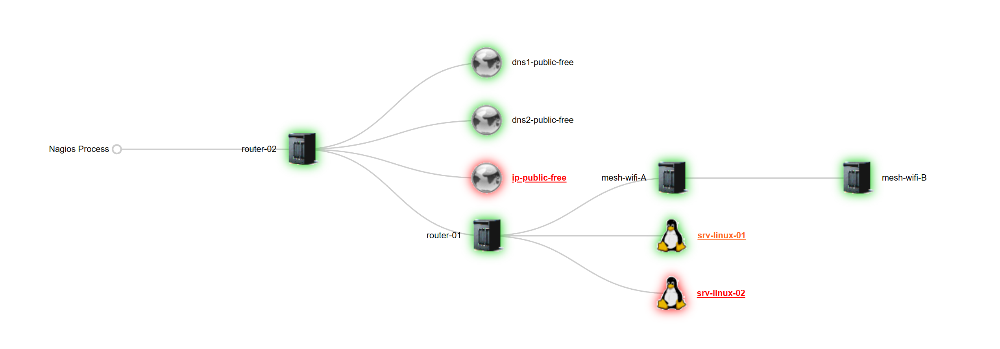

<div align="center">
  
  <br></br>
  
  <a href="https://github.com/0xCyberLiTech">
    
  </a>
  
  <br></br>

  <h2>Laboratoire numérique pour la cybersécurité, Linux & IT</h2>

  <p align="center">
    <a href="https://0xcyberlitech.github.io/">
      
    </a>
    <a href="https://github.com/0xCyberLiTech">
      
    </a>
    <a href="https://github.com/0xCyberLiTech/Nagios/releases/latest">
      
    </a>
    <a href="https://github.com/0xCyberLiTech/Nagios/blob/main/CHANGELOG.md">
      
    </a>
    <a href="https://github.com/0xCyberLiTech?tab=repositories">
      
    </a>
    <a href="https://github.com/0xCyberLiTech/Nagios/graphs/contributors">
      
    </a>
  </p>

</div>

<!--
Optimisation SEO : mots-clés Nagios, 0xCyberLiTech, supervision informatique, monitoring, Nagios, Zabbix, Smokeping, administration système, sécurité informatique, Linux, Debian, tutoriels supervision, guides monitoring, alertes réseau, performance réseau, open source, ressources techniques, IT, professionnels, étudiants, passionnés, gestion d’infrastructure, surveillance réseau, outils de supervision.
-->

<div align="center">
  
</div>

<div align="center">
  <p>
    <strong>Cybersécurité</strong>  • <strong>Linux Debian</strong>  • <strong>Sécurité informatique</strong> 
  </p>
</div>

---

## 🚀 À propos & Objectifs

Ce projet propose des solutions innovantes et accessibles en cybersécurité, avec une approche centrée sur la simplicité d’utilisation et l’efficacité. Il vise à accompagner les utilisateurs dans la protection de leurs données et systèmes, tout en favorisant l’apprentissage et le partage des connaissances.

Le contenu est structuré, accessible et optimisé SEO pour répondre aux besoins de :
- 🎓 Étudiants : approfondir les connaissances
- 👨‍💻 Professionnels IT : outils et pratiques
- 🖥️ Administrateurs système : sécuriser l’infrastructure
- 🛡️ Experts cybersécurité : ressources techniques
- 🚀 Passionnés du numérique : explorer les bonnes pratiques

---

## 📡 Installation de Nagios Core & Plugins depuis les sources (2025).

## 🔧 Prérequis :

Assurez-vous d’avoir un système Debian à jour.

## 📁 1. Préparation du répertoire de travail.

```bash
mkdir -p /opt/nagios/
cd /opt/nagios/
```

## 🔄 2. Mise à jour du système.

```bash
apt update && apt upgrade -y
```

## 📦 3. Installation des dépendances nécessaires.

```bash
apt install -y \
  autoconf \
  build-essential \
  gcc \
  libc6 \
  make \
  wget \
  unzip \
  apache2 \
  apache2-utils \
  libapache2-mod-php \
  php \
  php-gd \
  libgd-dev \
  openssl \
  libssl-dev \
  curl
```

## 📥 4. Téléchargement et extraction de la dernière version de Nagios Core.

```bash
NAGIOS_VER=$(curl -s https://api.github.com/repos/NagiosEnterprises/nagioscore/releases/latest | grep tag_name | cut -d '"' -f 4)
wget https://github.com/NagiosEnterprises/nagioscore/releases/download/$NAGIOS_VER/$NAGIOS_VER.tar.gz
tar -xvzf $NAGIOS_VER.tar.gz
cd $NAGIOS_VER
```

## 🛠️ 5. Compilation et installation de Nagios Core.

```bash
./configure --with-httpd-conf=/etc/apache2/sites-enabled
make all
make install-groups-users
usermod -a -G nagios www-data
make install
make install-daemoninit
make install-commandmode
make install-config
make install-webconf
```

## 🌐 6. Activation des modules Apache.

```bash
a2enmod rewrite
a2enmod cgi
```

## 🔥 7. (Optionnel) Ouverture du port 80 via iptables.

```bash
# iptables -I INPUT -p tcp --destination-port 80 -j ACCEPT
# apt install -y iptables-persistent
```

> Acceptez l’enregistrement des règles si demandé.

## 👤 8. Création de l'utilisateur `nagiosadmin`

```bash
htpasswd -c /usr/local/nagios/etc/htpasswd.users nagiosadmin
```

## 🌐 9. Redirection vers l’interface web Nagios.

```bash
echo 'RedirectMatch ^/$ /nagios' >> /etc/apache2/apache2.conf
```

## ▶️ 10. Démarrage des services.

```bash
systemctl start apache2.service
systemctl start nagios.service
```

---

## ✅ Accès à l’interface Web.

Rendez-vous à l’adresse suivante dans un navigateur :

```
http://<IP_SERVEUR>/nagios
http://<FQDN_SERVEUR>/nagios
```

Utilisez l’identifiant `nagiosadmin` et le mot de passe défini précédemment.

---

# 🔌 Installation des Plugins Nagios.

## 📦 1. Installation des dépendances.

```bash
cd /opt/nagios/
apt install -y \
  autoconf \
  gcc \
  libc6 \
  libmcrypt-dev \
  make \
  libssl-dev \
  wget \
  bc \
  gawk \
  dc \
  build-essential \
  snmp \
  libnet-snmp-perl \
  gettext
```

## 📥 2. Téléchargement de la dernière version des plugins.

```bash
VER=$(curl -s https://api.github.com/repos/nagios-plugins/nagios-plugins/releases/latest | grep tag_name | cut -d '"' -f 4 | sed 's/release-//')
wget https://github.com/nagios-plugins/nagios-plugins/releases/download/release-$VER/nagios-plugins-$VER.tar.gz
```

### 🔁 Si les liens échouent :

Rendez-vous sur [https://nagios-plugins.org/download/](https://nagios-plugins.org/download/), puis :

```bash
VER=2.4.8
wget https://nagios-plugins.org/download/nagios-plugins-$VER.tar.gz
```

## 🗜️ 3. Extraction et compilation.

```bash
tar -xvzf nagios-plugins-${VER}.tar.gz
cd nagios-plugins-$VER
./tools/setup   # (facultatif)
./configure
make
make install
```

---

## 🧪 Vérification dans l’interface Web.

```
http://<IP_SERVEUR>/nagios
http://<FQDN_SERVEUR>/nagios
```

- Vérifiez que les plugins sont visibles.
- Pensez à décommenter les variables `parents` dans vos fichiers de config si vous utilisez une topologie.

### Exemple de rendu :

  


---

## ♻️ Redémarrage des services.

```bash
systemctl restart apache2.service
systemctl restart nagios.service
```

---

## 🎉 Félicitations !

Nagios Core et ses plugins sont maintenant installés et fonctionnels 🎊

---

<div align="center">
  <a href="https://github.com/0xCyberLiTech" target="_blank" rel="noopener">
    
  </a>
</div>

<p align="center">
  <b>🔐 Un guide proposé par <a href="https://github.com/0xCyberLiTech">0xCyberLiTech</a> • Pour une cybersécurité compréhensible et efficace. 🔐</b>
</p>
