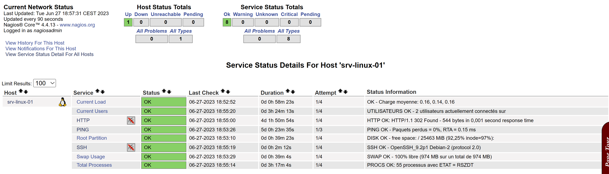

<div align="center">

  
  
  <a href="https://github.com/0xCyberLiTech">
    
  </a>
  
  <p align="center">
    <em>Tutoriels et configurations pour la supervision avec Nagios Core.</em><br>
    <b>📊 Monitoring – 📈 Performance – ⚙️ Fiabilité</b>
  </p>
  
  [](https://github.com/0xCyberLiTech)
  [](https://github.com/0xCyberLiTech/Supervision/releases/latest)
  [](https://github.com/0xCyberLiTech/Supervision/blob/main/CHANGELOG.md)
  [](https://github.com/0xCyberLiTech?tab=repositories)
  [](https://github.com/0xCyberLiTech/Supervision/graphs/contributors)

</div>

---

### 👨‍💻 **À propos de moi.**

> Bienvenue dans mon **laboratoire numérique personnel** dédié à l’apprentissage et à la vulgarisation de la cybersécurité.  
> Passionné par **Linux**, la **cryptographie** et les **systèmes sécurisés**, je partage ici mes notes, expérimentations et fiches pratiques.  
>  
> Pproposer un contenu clair, structuré et accessible pour étudiants, curieux et professionnels de l’IT.  
> 🔗 [Mon GitHub principal](https://github.com/0xCyberLiTech)

<p align="center">
  <a href="https://github.com/0xCyberLiTech" target="_blank" rel="noopener">
    
  </a>
</p>

---

### 🎯 **Objectif de ce dépôt.**

> Ce dépôt a pour vocation de centraliser un ensemble de notions clés en supervision informatique. Il s’adresse aux passionnés, étudiants et professionnels souhaitant mieux comprendre les enjeux de la
> surveillance des systèmes d'information, apprendre à mettre en place des outils de monitoring efficaces et se familiariser avec les concepts et bonnes pratiques pour maintenir la performance et la stabilité de
> leurs environnements IT.

---

<a name="Exemple-nagios.cfg.md"></a>

## Exemple concernant le fichier /usr/local/nagios/etc/nagios.cfg

```
# --------------------------------------------------------------------------
# 0xCyberLiTech
# Date de création : le 10-07-2025
# Date de modification : le 10-07-2025
# NAGIOS.CFG - Exemple de fichier de configuration pour Nagios.
# /usr/local/nagios/etc/nagios.cfg
# --------------------------------------------------------------------------

# LOG FILE
# This is the main log file where service and host events are logged
# for historical purposes.  This should be the first option specified
# in the config file!!!

log_file=/usr/local/nagios/var/nagios.log

# OBJECT CONFIGURATION FILE(S)
# These are the object configuration files in which you define hosts,
# host groups, contacts, contact groups, services, etc.
# You can split your object definitions across several config files
# if you wish (as shown below), or keep them all in a single config file.

# You can specify individual object config files as shown below:
cfg_file=/usr/local/nagios/etc/objects/commands.cfg
cfg_file=/usr/local/nagios/etc/objects/contacts.cfg
cfg_file=/usr/local/nagios/etc/objects/timeperiods.cfg
cfg_file=/usr/local/nagios/etc/objects/templates.cfg

# Definitions for monitoring the local (Linux) host
cfg_file=/usr/local/nagios/etc/objects/localhost.cfg

# Definitions for monitoring a Windows machine
#cfg_file=/usr/local/nagios/etc/objects/windows.cfg

# Definitions for monitoring a router/switch
#cfg_file=/usr/local/nagios/etc/objects/switch.cfg

# Definitions for monitoring a network printer
#cfg_file=/usr/local/nagios/etc/objects/printer.cfg
```

Nous pouvons constater que les lignes suivantes de base ne sont pas commentées (#) :

```
cfg_file=/usr/local/nagios/etc/objects/commands.cfg
cfg_file=/usr/local/nagios/etc/objects/contacts.cfg
cfg_file=/usr/local/nagios/etc/objects/timeperiods.cfg
cfg_file=/usr/local/nagios/etc/objects/templates.cfg
cfg_file=/usr/local/nagios/etc/objects/localhost.cfg
```

Donc ces fichiers existent vers /usr/local/nagios/etc/objects/
Il est donc possible de déclarer arbitrairement de nouveaux fichiers dans /usr/local/nagios/etc/nagios.cfg

```
Exemples :

cfg_file=/usr/local/nagios/etc/objects/serveurs-linux.cfg
cfg_file=/usr/local/nagios/etc/objects/serveurs-windows.cfg
cfg_file=/usr/local/nagios/etc/objects/routeurs.cfg
cfg_file=/usr/local/nagios/etc/objects/imprimantes.cfg
```

A partir de cet instant il faudra créer ceux-ci vers /usr/local/nagios/etc/objects/

```
touch /usr/local/nagios/etc/objects/serveurs-linux.cfg
touch /usr/local/nagios/etc/objects/serveurs-windows.cfg
touch /usr/local/nagios/etc/objects/routeurs.cfg
touch /usr/local/nagios/etc/objects/imprimantes.cfg
```

Je vous conseille de mettre en service qu'un fichier à la fois.

```
cfg_file=/usr/local/nagios/etc/objects/serveurs-linux.cfg
#cfg_file=/usr/local/nagios/etc/objects/serveurs-windows.cfg
#cfg_file=/usr/local/nagios/etc/objects/routeurs.cfg
#cfg_file=/usr/local/nagios/etc/objects/imprimantes.cfg
```

Ne pas oublier de sauvegarder votre fichier /usr/local/nagios/etc/nagios.cfg
Positionner les droits qui conviennent sur ces fichiers.

```
chown nagios:nagios /usr/local/nagios/etc/objects/serveurs-linux.cfg
chown nagios:nagios /usr/local/nagios/etc/objects/serveurs-windows.cfg
chown nagios:nagios /usr/local/nagios/etc/objects/routeurs.cfg
chown nagios:nagios /usr/local/nagios/etc/objects/imprimantes.cfg
```

Exemple, configuration injectée dans le fichier /usr/local/nagios/etc/objects/serveur-linux.cfg

```
# --------------------------------------------------------------------------
# 0xCyberLiTech
# Date de création : le 21-06-2023
# Date de modification : le 27-06-2023
# SERVERS-LINUX.CFG - /usr/local/nagios/etc/objects/
# --------------------------------------------------------------------------

# --------------------------------------------------------------------------
# SERVEUR LOCAL : srv-linux-01
# --------------------------------------------------------------------------
# --------------------------------------------------------------------------
# DEFINITION HOST - srv-linux-01
# --------------------------------------------------------------------------
define host {

     use                     linux-server

     host_name               srv-linux-01
     alias                   srv-linux-01
     address                 192.168.50.200
     hostgroups              grp-server-linux
     parents                 router-01
}

# --------------------------------------------------------------------------
# DEFINITION HOST - srv-linux-02
# --------------------------------------------------------------------------
define host {

     use                     linux-server

     host_name               srv-linux-02
     alias                   srv-linux-02
     address                 192.168.50.201
     hostgroups              grp-server-linux
     parents                 router-01
}

# --------------------------------------------------------------------------
# DEFINITION HOST GROUP - grp-server-linux
# --------------------------------------------------------------------------
define hostgroup {

     hostgroup_name          grp-server-linux
     alias                   Host Groups server linux
}

# --------------------------------------------------------------------------
# DEFINITION SERVICE - srv-linux-01 - ping
# --------------------------------------------------------------------------
define service {

     use                     generic-service
     host_name               srv-linux-01
     service_description     PING
     check_command           check_ping!100.0,20%!500.0,60%
     #check_command          check_ping!900.0,40%!1500.0,70%
     #check_command          check_ping!3000.0,80%!5000.0,100%
     check_interval          5
     retry_interval          1
}

# --------------------------------------------------------------------------
# DEFINITION SERVICE - srv-linux-01 - check_local_disk
# --------------------------------------------------------------------------
# Définir un service pour vérifier l'espace disque de la partition racine
# sur la machine locale. Avertissement si < 20 % libre, critique si
# < 10 % d'espace libre sur la partition.
define service {

    use                     local-service
    host_name               srv-linux-01
    service_description     Root Partition
    check_command           check_local_disk!20%!10%!/
}

# --------------------------------------------------------------------------
# DEFINITION SERVICE - srv-linux-01 - check_local_users
# --------------------------------------------------------------------------
# Définissez un service pour vérifier le nombre de personnes actuellement connectées
# utilisateurs sur la machine locale. Avertissement si > 20 utilisateurs, critique
# si > 50 utilisateurs.
define service {

    use                     local-service
    host_name               srv-linux-01
    service_description     Current Users
    check_command           check_local_users!20!50
}

# --------------------------------------------------------------------------
# DEFINITION SERVICE - srv-linux-01 - check_local_procs
# --------------------------------------------------------------------------
# Définir un service pour vérifier le nombre de procs en cours d'exécution
# sur la machine locale. Avertissement si > 250 processus, critique si
# > 400 processus.
define service {

    use                     local-service
    host_name               srv-linux-01
    service_description     Total Processes
    check_command           check_local_procs!250!400!RSZDT
}

# --------------------------------------------------------------------------
# DEFINITION SERVICE - srv-linux-01 - check_local_load
# --------------------------------------------------------------------------
# Définissez un service pour vérifier la charge sur la machine locale.
define service {

    use                     local-service
    host_name               srv-linux-01
    service_description     Current Load
    check_command           check_local_load!5.0,4.0,3.0!10.0,6.0,4.0
}

# --------------------------------------------------------------------------
# DEFINITION SERVICE - srv-linux-01 - check_local_swap
# --------------------------------------------------------------------------
# Définissez un service pour vérifier l'utilisation du swap sur la machine locale.
# Critique si moins de 10 % du swap est libre, avertissement si moins de 20 % est libre.
define service {

    use                     local-service
    host_name               srv-linux-01
    service_description     Swap Usage
    check_command           check_local_swap!20%!10%
}

# --------------------------------------------------------------------------
# DEFINITION SERVICE - srv-linux-01 - check_local_ssh
# --------------------------------------------------------------------------
# Définissez un service pour vérifier SSH sur la machine locale.
# Désactivez les notifications pour ce service par défaut, car tous les utilisateurs n'ont peut-être pas activé SSH.
define service {

    use                     local-service
    host_name               srv-linux-01
    service_description     SSH
    #check_command          check_ssh
    check_command           check_ssh!2234
    notifications_enabled   0
}

# --------------------------------------------------------------------------
# DEFINITION SERVICE - srv-linux-01 - check_local_http
# --------------------------------------------------------------------------
# Définissez un service pour vérifier HTTP sur la machine locale.
# Désactivez les notifications pour ce service par défaut, car HTTP n'est peut-être pas activé pour tous les utilisateurs.
define service {

    use                     local-service
    host_name               srv-linux-01
    service_description     HTTP
    check_command           check_http
    notifications_enabled   0
}

# --------------------------------------------------------------------------
# SERVEUR DISTANT : srv-linux-02
# --------------------------------------------------------------------------
# --------------------------------------------------------------------------
# DEFINITION SERVICE - srv-linux-02 - ping
# --------------------------------------------------------------------------
define service {

     use                     generic-service
     host_name               srv-linux-02
     service_description     PING
     check_command           check_ping!100.0,20%!500.0,60%
     #check_command          check_ping!900.0,40%!1500.0,70%
     #check_command          check_ping!3000.0,80%!5000.0,100%
     check_interval          5
     retry_interval          1
}
```

Tester dabord votre nouvelle configuration que vous avez saisie dans le fichier /usr/local/nagios/etc/objects/serveur-linux.cfg à l'aide de la commande suivante :

```
# --------------------------------------------------------------------------
# - MOD DEBUG - MOD DEBUG - MOD DEBUG - MOD DEBUG - MOD DEBUG - MOD DEBUG -
# --------------------------------------------------------------------------
/usr/local/nagios/bin/nagios -v /usr/local/nagios/etc/nagios.cfg

Checking objects...
        Checked 10 services.
        Checked 3 hosts.
        Checked 2 host groups.
        Checked 0 service groups.
        Checked 1 contacts.
        Checked 1 contact groups.
        Checked 24 commands.
        Checked 5 time periods.
        Checked 0 host escalations.
        Checked 0 service escalations.
Checking for circular paths...
        Checked 3 hosts
        Checked 0 service dependencies
        Checked 0 host dependencies
        Checked 5 timeperiods
Checking global event handlers...
Checking obsessive compulsive processor commands...
Checking misc settings...

Total Warnings: 0
Total Errors:   0
```

Si il n'y a pas d'erreur sur cette nouvelle configuration (server-linux.cfg), redémarrer Nagios pour la prise en compte de cette configuration.

```
systemctl restart nagios.service
```

```
systemctl status nagios.service

● nagios.service - Nagios Core 4.4.13
     Loaded: loaded (/lib/systemd/system/nagios.service; enabled; preset: enabled)
     Active: active (running) since Sun 2023-06-25 10:45:29 CEST; 8s ago
       Docs: https://www.nagios.org/documentation
    Process: 13282 ExecStartPre=/usr/local/nagios/bin/nagios -v /usr/local/nagios/etc/nagios.cfg (code=exited, status=0/SUCCESS)
    Process: 13283 ExecStart=/usr/local/nagios/bin/nagios -d /usr/local/nagios/etc/nagios.cfg (code=exited, status=0/SUCCESS)
   Main PID: 13284 (nagios)
      Tasks: 12 (limit: 4644)
     Memory: 7.9M
        CPU: 115ms
     CGroup: /system.slice/nagios.service
             ├─13284 /usr/local/nagios/bin/nagios -d /usr/local/nagios/etc/nagios.cfg
             ├─13285 /usr/local/nagios/bin/nagios --worker /usr/local/nagios/var/rw/nagios.qh
             ├─13286 /usr/local/nagios/bin/nagios --worker /usr/local/nagios/var/rw/nagios.qh
             ├─13287 /usr/local/nagios/bin/nagios --worker /usr/local/nagios/var/rw/nagios.qh
             ├─13288 /usr/local/nagios/bin/nagios --worker /usr/local/nagios/var/rw/nagios.qh
             ├─13289 /usr/local/nagios/bin/nagios --worker /usr/local/nagios/var/rw/nagios.qh
             ├─13290 /usr/local/nagios/bin/nagios --worker /usr/local/nagios/var/rw/nagios.qh
             ├─13291 /usr/local/nagios/bin/nagios -d /usr/local/nagios/etc/nagios.cfg
             ├─13292 /usr/local/nagios/libexec/check_ping -H 192.168.50.200 -w 100.0,20% -c 500.0,60% -p 5
             ├─13293 /usr/bin/ping -n -U -w 10 -c 5 192.168.50.200
             ├─13295 /usr/local/nagios/libexec/check_ping -H 192.168.50.110 -w 100.0,20% -c 500.0,60% -p 5
             └─13297 /usr/bin/ping -n -U -w 10 -c 5 192.168.50.110
```

Nous pouvons voir, que la machine (srv-linux-01) en local est monitorée.



La prochaine étape consiste à monitorer la machine distante (srv-linux-02) avec le plugin NRPE. [Installation_NRPE_4.1.0-server](Installation_NRPE_4.1.0-server.md)

---

<p align="center">
  <b>🔐 Un guide proposé par <a href="https://github.com/0xCyberLiTech">0xCyberLiTech</a> • Pour une cybersécurité compréhensible et efficace. 🔐</b>
</p>
