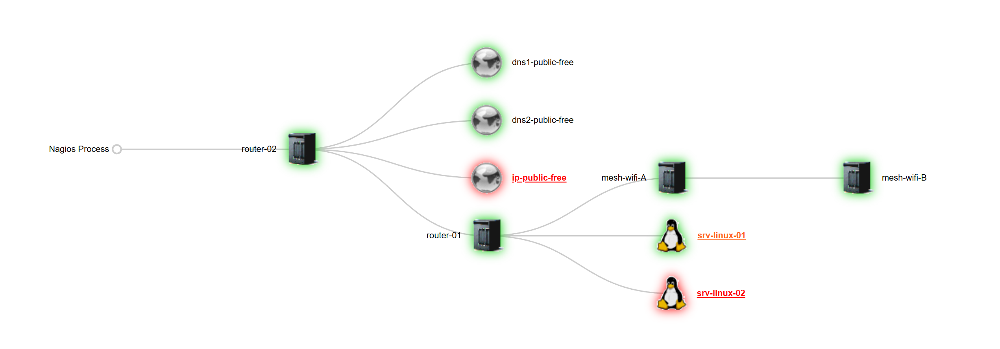
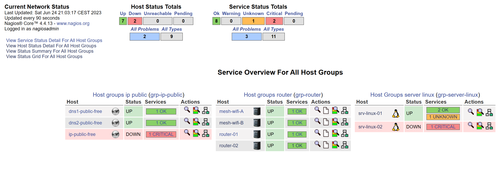

# Installation de Nagios-core & Nagios-plugins sur DEBIAN 11 & 12.
Celle-ci est effectuée depuis les sources.

## Les étapes suivantes sont à réaliser :

| Cat | Etapes |
|------|------| 
| - A. | [Préparation avant l'installation de Nagios.](#préparation-avant-installation-de-nagios) |
| - B. | [Téléchargement des sources de Nagios-core dans sa dernère version stable.](#téléchargement-de-nagios-core) |
| - C. | [Compilation depuis les sources de Nagios-core.](#compilation-de-Nagios-core) |
| - D. | [Téléchargement des sources de Nagios-plugins dans sa dernère version stable.](#téléchargement-de-nagios-plugins) |
| - E. | [Compilation depuis les sources de Nagios-plugins.](#compilation-de-Nagios-plugins) |
| - F. | [Tester à nouveau Nagios.](#test-de-Nagios) |
| - G. | [Installation automatisée de Nagios-core & Nagios-plugins.](#installation-automatisée-Nagios-core) |
| - H. | [Installation du plugin NRPE 4.1.0 depuis le serveur qui héberge Nagios Core.](Installation_NRPE_4.1.0-server.md) |
| - I. | [Installation du plugin NRPE 4.1.0 + Nagios-plugins depuis la machine distante Linux à monitorer.](Installation_NRPE_4.1.0-client.md) |
| - J. | [Installer et configurer (NTPsec).](https://github.com/0xCyberLiTech/Smokeping/blob/main/install-ntpsec.md) |

## Exemples concernant les fichiers de configuration Nagios :

| Cat | Etapes |
|------|------| 
| - A. | [ Exemple du fichier contacts.cfg.](Exemple-contacts.cfg.md) |
| - B. | [ Exemple du fichier nagios.cfg.](Exemple-nagios.cfg.md) |
| - C. | [ Exemple du fichier hostextinfo.cfg.](Exemple-hostextinfo.cfg.md) |
| - D. | [ Exemple du fichier templates.cfg.](Exemple-templates.cfg.md) |
| - E. | [ Exemple du fichier server-linux.cfg](Exemple-server-linux.cfg.md) |
| - F. | [ Exemple du fichier router.cfg](Exemple-router.cfg.md) |
| - G. | [ Exemple du fichier ip-public.cfg](Exemple-ip-public.cfg.md) |

<a name="préparation-avant-installation-de-nagios"></a>

## - A. Préparation avant l'installation de Nagios-core.

Création du sous dossier /opt/nagios/.
```
mkdir -p /opt/nagios
cd /opt/nagios
```
Mettre à jour les paquets.
```
apt update && apt upgrade -y
```
- Installation de Nagios-core dans sa dernière version stable.
- Conditions préalables.
- Installer les packages prérequis.
```
apt install -y \
       autoconf \
       build-essential \
       gcc \
       libc6 \
       make \
       wget \
       unzip \
       apache2 \
       apache2-utils \
       libapache2-mod-php \
       php \
       php-gd \
       libgd-dev \
       openssl \
       libssl-dev \
       curl
```

<a name="téléchargement-de-nagios-core"></a>

## - B. Téléchargement des sources de Nagios-core dans sa dernère version stable.
```
NAGIOS_VER=$(curl -s https://api.github.com/repos/NagiosEnterprises/nagioscore/releases/latest|grep tag_name | cut -d '"' -f 4)
wget https://github.com/NagiosEnterprises/nagioscore/releases/download/$NAGIOS_VER/$NAGIOS_VER.tar.gz
```
- Extraire l'archive $NAGIOS_VER.tar.gz.
```
tar -xvzf $NAGIOS_VER.tar.gz
```
<a name="compilation-de-Nagios-core"></a>

## - C. Compilation depuis les sources de Nagios-core.
```
cd $NAGIOS_VER
./configure --with-httpd-conf=/etc/apache2/sites-enabled
make all
```
- Créer un utilisateur et un groupe.
Cela crée l'utilisateur et le groupe nagios. L'utilisateur www-data est également ajouté au groupe nagios.
```
make install-groups-users
usermod -a -G nagios www-data
```
- Installer les binaires.
Cette étape installe les fichiers binaires, les CGI et les fichiers HTML.
```
make install
```
- Install Service / Daemon.
Cela installe les fichiers de service ou de deamon et les configure également pour démarrer automatiquement ...
```
make install-daemoninit
```
- Installation Command Mode.
Ceci installe et configure le fichier de commande externe.
```
make install-commandmode
```
- Installer les fichiers de configuration.
Ceci installe les fichiers de configuration *SAMPLE*. Ceux-ci sont nécessaires car Nagios a besoin de certains fichiers de configuration pour lui permettre de démarrer.
```
make install-config
```
- Installer les fichiers de configuration Apache.
Cela installe les fichiers de configuration du serveur Web Apache et configure les paramètres Apache.
```
make install-webconf
a2enmod rewrite
a2enmod cgi
```
- Configurer le pare-feu.
Vous devez autoriser le trafic entrant du port 80 sur le pare-feu local afin de pouvoir accéder à l'interface Web de Nagios Core.
```
#iptables -I INPUT -p tcp --destination-port 80 -j ACCEPT
#apt-get install -y iptables-persistent
```
Répondre oui à l'enregistrement des règles existantes.

- Créer un compte utilisateur nagiosadmin.
Vous devrez créer un compte utilisateur Apache pour pouvoir vous connecter à Nagios.
La commande suivante créera un compte d'utilisateur appelé nagiosadmin et vous serez invité à fournir un mot de passe pour le compte.
```
htpasswd -c /usr/local/nagios/etc/htpasswd.users nagiosadmin
```
- Commandes service / deamon
Redirect root URL (/$) to /nagios
Démarrer le serveur Web Apache2.
```
echo 'RedirectMatch ^/$ /nagios' >> /etc/apache2/apache2.conf
systemctl start apache2.service
```
Démarrer Service / Daemon Nagios.
```
systemctl start nagios.service
```
- Test d'accès à Nagios.
Nagios est maintenant en cours d'exécution, pour le confirmer, vous devez vous connecter à l'interface Web de Nagios.
Faites pointer votre navigateur Web vers l'adresse IP ou le FQDN de votre serveur Nagios Core, par exemple :
```
http://mon-ip/nagios
http://FQDN/nagios
```
Vous serez invité à entrer un nom d'utilisateur et un mot de passe. Le nom d'utilisateur est nagiosadmin (vous l'avez créé lors d'une étape précédente) et le mot de passe est celui que vous avez fourni précédemment.
Une fois connecté, l'interface de Nagios s'affiche. Félicitations, vous avez installé Nagios Core.

- Installation de Nagios-plugins dans sa dernière version stable.
- Conditions préalables.
- Installer les packages prérequis.
```
cd /opt/nagios/
```
```
apt install -y \
       autoconf \
       gcc \
       libc6 \
       libmcrypt-dev \
       make \
       libssl-dev \
       wget \
       bc \
       gawk \
       dc \
       build-essential \
       snmp \
       libnet-snmp-perl \
       gettext
```

<a name="téléchargement-de-nagios-plugins"></a>

## - D. Téléchargement des sources de Nagios-plugins dans sa dernère version stable.

```
VER=$(curl -s https://api.github.com/repos/nagios-plugins/nagios-plugins/releases/latest|grep tag_name | cut -d '"' -f 4|sed 's/release-//')
wget https://github.com/nagios-plugins/nagios-plugins/releases/download/release-$VER/nagios-plugins-$VER.tar.gz
```

- Extraire l'archive nagios-plugins-$VER.tar.gz.

```
tar xvf nagios-plugins-$VER.tar.gz
```
<a name="compilation-de-Nagios-plugins"></a>

## - E. Compilation depuis les sources de Nagios-plugins.

```
cd nagios-plugins-$VER
./tools/setup
./configure
make
make install
```

<a name="test-de-Nagios"></a>

## - F. Tester à nouveau Nagios.
Faites pointer votre navigateur Web vers l'adresse IP ou le FQDN de votre serveur Nagios Core, par exemple :

```
http://mon-ip/nagios
http://FQDN/nagios
```

Avec les différents fichiers de configuration présentés en guise d'exemple, notre map Nagios ressemblera à ça.
Décommenté la variable 'parents' dans les fichiers de configuration donnés en exemple.




- Redémarrer / Daemon Apache2.
- Redémarrer le serveur Web Apache.

```
systemctl restart apache2.service
```
Redémarrer / Daemon Nagios.
```
systemctl restart nagios.service
```
Purge.
```
rm -rf $TEMP_FOLDER
```
<a name="installation-automatisée-Nagios-core"></a>

## - G. Installation automatisée de Nagios-core & Nagios-plugins.

Via un fichier bash.
[Disponible ici](install-nagios.sh)
```
touch install-nagios.sh
chmod +x install-nagios.sh
sudo ./install-nagios.sh
```
